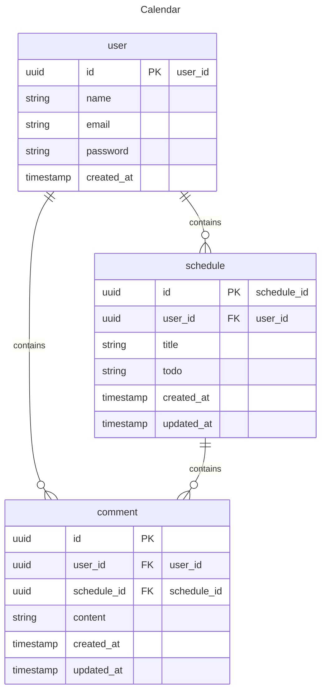

# 일정 관리 앱 Develop 과제

일정을 관리할 수 있는 앱 API 만들기

## 프로젝트 목표

- 기본 `CRUD`에 대한 구조 학습
- `JPA`를 활용한 데이터베이스 관리
- `Cookie/Session`을 활용한 인증/인가

## 주요 기능

- 유저
    - 회원가입, 로그인을 할 수 있다.
        - 중복된 이메일이 이미 존재한다면 회원가입할 수 없다.
        - 비밀번호가 일치하지 않다면 로그인할 수 없다.
    - 로그아웃을 할 수 있다.
        - 로그인을 하지 않은 유저는 로그아웃을 할 수 없다.
    - 유저의 정보를 조회할 수 있다.
    - 본인의 정보를 수정하거나 삭제할 수 있다.
        - 본인이 아니라면 수정, 삭제할 수 없다.
- 일정
    - 일정을 생성할 수 있다.
        - 로그인을 하지 않은 유저는 일정을 작성할 수 없다.
    - 일정을 전체 조회할 수 있다.
        - 최근 수정일을 기준으로 조회한다.
        - 페이지당 10개의 일정을 조회한다.
    - 일정을 조회할 수 있다.
    - 일정을 수정할 수 있다.
        - 로그인을 하지 않거나 본인의 일정이 아니라면 일정을 수정할 수 없다.
    - 일정을 삭제할 수 있다.
        - 로그인을 하지 않거나 본인의 일정이 아니라면 일정을 삭제할 수 없다.
- 댓글
    - 일정에 댓글을 생성할 수 있다.
        - 로그인을 하지 않은 유저는 댓글을 작성할 수 없다.
    - 일정안에 댓글을 전체 조회할 수 있다.
        - 최근 작성일을 기준으로 조회한다.
    - 댓글을 수정할 수 있다.
        - 로그인을 하지 않거나 본인의 댓글이 아니라면 댓글을 수정할 수 없다.
    - 댓글을 삭제할 수 있다.
        - 로그인을 하지 않거나 본인의 댓글이 아니라면 댓글을 삭제할 수 없다.

## API 명세서

- [REST Docs](https://hongseungkeun.github.io/schedule-jpa/src/main/resources/static/docs/index.html)

## ERD

## 기능 요구 사항

### Lv 0. API 명세 및 ERD 작성

- **API 명세서 작성하기**
    - API명세서는 프로젝트 root(최상위) 경로의 `README.md` 에 작성
    - 참고) API 명세서 작성 가이드
        - API 명세서란 API명, 요청 값(파라미터), 반환 값, 인증/인가 방식, 데이터 및 전달 형식 등 API를 정확하게 호출하고 그 결과를 명확하게 해석하는데 필요한 정보들을 일관된 형식으로 기술한
          것을 의미합니다.
        - request 및 response는 `JSON` 형태로 작성합니다.
- **ERD 작성하기**
    - ERD는 프로젝트 root(최상위) 경로의 `README.md` 에 첨부
    - 참고) ERD 작성 가이드
        - API 명세 작성을 통해 서비스의 큰 흐름과 기능을 파악 하셨다면 이제는 기능을 구현하기 위해 필요한 데이터가 무엇인지 생각해봐야합니다.
            - 이때, 구현해야 할 서비스의 영역별로 필요한 데이터를 설계하고 각 영역간의 관계를 표현하는 방법이 있는데 이를 ERD(Entity Relationship Diagram)라 부릅니다.
        - ERD 작성간에 다음과 같은 항목들을 학습합니다.
            - E(Entity. 개체)
                - 구현 할 서비스의 영역에서 필요로 하는 데이터를 담을 개체를 의미합니다.
                    - ex) `책`, `저자`, `독자`, `리뷰`
            - A(Attribute. 속성)
                - 각 개체가 가지는 속성을 의미합니다.
                    - ex) 책은 `제목`, `언어`, `출판일`, `저자`, `가격` 등의 속성을 가질 수 있습니다.
            - R(Relationship. 관계)
                - 개체들 사이의 관계를 정의합니다.
                    - ex) `저자`는 여러 권의 `책`을 집필할 수 있습니다. 이때, 저자와 책의 관계는 일대다(1:N) 관계입니다.
- **SQL 작성하기**
    - 설치한 데이터베이스(Mysql)에 ERD를 따라 테이블을 생성
    - 참고) SQL 작성 가이드
        - 과제 프로그램의 root(최상위) 경로에`schedule.sql` 파일을 만들고, 테이블 생성에 필요한 query를 작성하세요.

### Lv 1. 일정 CRUD

- 일정을 생성, 조회, 수정, 삭제할 수 있습니다.
- 일정은 아래 필드를 가집니다.
    - `작성 유저명`, `할일 제목`, `할일 내용`, `작성일`, `수정일` 필드
    - `작성일`, `수정일` 필드는 `JPA Auditing`을 활용합니다.

### Lv 2. 유저 CRUD

- 유저를 생성, 조회, 수정, 삭제할 수 있습니다.
- 유저는 아래와 같은 필드를 가집니다.
    - `유저명`, `이메일`, `작성일` 필드
    - `작성일` 필드는 `JPA Auditing`을 활용하여 적용합니다.
- 연관관계 구현
    - 일정은 이제 `작성 유저명` 필드 대신 `유저 고유 식별자` 필드를 가집니다.

### Lv 3. 회원가입

- 유저에 `비밀번호` 필드를 추가합니다.
    - 비밀번호 암호화는 도전 기능에서 수행합니다.

### Lv 4. 로그인(인증)

- 키워드
    - **인터페이스**
        - HttpServletRequest / HttpServletResponse : 각 HTTP 요청에서 주고받는 값들을 담고 있습니다.
- **설명**
    - **Cookie/Session**을 활용해 로그인 기능을 구현합니다.
    - 필터를 활용해 인증 처리를 할 수 있습니다.
    - `@Configuration` 을 활용해 필터를 등록할 수 있습니다.
- **조건**
    - `이메일`과 `비밀번호`를 활용해 로그인 기능을 구현합니다.
    - 회원가입, 로그인 요청은 인증 처리에서 제외합니다.
- **예외처리**
    - 로그인 시 이메일과 비밀번호가 일치하지 않을 경우 HTTP Status code 401을 반환합니다.

### Lv 5. 다양한 예외처리 적용하기

- `Validation`을 활용해 다양한 예외처리를 적용해 봅니다.
- 정해진 예외처리 항목이 있는것이 아닌 프로젝트를 분석하고 예외사항을 지정해 봅니다.
    - Ex) 할일 제목은 10글자 이내, 유저명은 4글자 이내
    - `@Pattern`을 사용해서 회원 가입 Email 데이터 검증 등
        - 정규표현식을 적용하되, 정규표현식을 어떻게 쓰는지 몰두하지 말 것!
        - 검색해서 나오는 것을 적용하는 것으로 충분!
- 발생 가능한 예외
    - User
        - Entity
            - 유저명 : 4글자 이내
            - 비밀번호 : 8글자 이상
            - 이메일 : 이메일 형식에 맞게 ex) xxx@gmail.com
        - 기능
            - 이메일 중복 시
            - 해당 유저가 존재하지 않을 때
            - 비밀번호가 일치하지 않을 때
            - 다른 유저가 변경(수정, 삭제)을 시도할 때
    - Schedule
        - Entity
            - 할일 제목 : 10글자 이내
            - 할일 : 200글자 이내
        - 기능
            - 해당 일정이 존재하지 않을 때
            - 다른 유저가 변경(수정, 삭제)을 시도할 때
    - 공통
        - 로그인하지 않은 유저가 회원가입, 로그인, 조회 이외의 요청을 시도할 때

### Lv 6. 비밀번호 암호화

- Lv.3에서 추가한 `비밀번호` 필드에 들어가는 비밀번호를 암호화합니다.
    - 암호화를 위한 `PasswordEncoder`를 직접 만들어 사용합니다.

### Lv 7. 댓글 CRUD

- 생성한 일정에 댓글을 남길 수 있습니다.
    - 댓글과 일정은 연관관계를 가집니다.
- 댓글을 저장, 조회, 수정, 삭제할 수 있습니다.
- 댓글은 아래와 같은 필드를 가집니다.
    - `댓글 내용`, `작성일`, `수정일`, `유저 고유 식별자`, `일정 고유 식별자` 필드
    - `작성일`, `수정일` 필드는 `JPA Auditing`을 활용하여 적용합니다.

### Lv 8. 일정 페이징 조회

- 키워드
    - **데이터베이스**
        - offset / limit : SELECT 쿼리에 적용해서 데이터를 제한 범위에 맞게 조회할 수 있습니다.
    - **페이징**
        - Pageable : Spring Data JPA에서 제공되는 페이징 관련 인터페이스 입니다.
        - PageRequest : Spring Data JPA에서 제공되는 페이지 요청 관련 클래스입니다.
- 일정을 Spring Data JPA의 `Pageable`과 `Page` 인터페이스를 활용하여 페이지네이션을 구현
    - `페이지 번호`와 `페이지 크기`를 쿼리 파라미터로 전달하여 요청하는 항목을 나타냅니다.
    - `할일 제목`, `할일 내용`, `댓글 개수`, `일정 작성일`, `일정 수정일`, `일정 작성 유저명` 필드를 조회합니다.
    - 디폴트 `페이지 크기`는 10으로 적용합니다.
- 일정의 `수정일`을 기준으로 내림차순 정렬합니다.

## Lv 1. 숙련 필수사항 보완하기 `필수`

### 문서

#### 어떻게 진행할까요?

1. 필수 과제(~Lv4) 자가평가와 튜터평가가 다른 경우, 보완합니다.
    1. 이미 완료했다면, 다음 과제로 넘어가주세요.
    2. 구현에 성공하지 못했다면 이번 기회를 통해, 보완 및 구현을 시도해봅시다!
        - `CommentController` uri 변경
        - `filter`, `WebConfig` 주석 작성